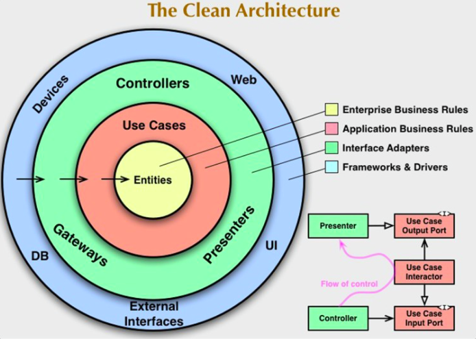

# Clean Architecture

The concentric circles represent different areas of software. In general, the further in we go, the higher level the software becomes. The outer circles are mechanisms. The inner circles are policies.

- These Architecture include:

* Hexagonal Architecture
* Onion Architecture
* Screaming Architecture
* DCI
* BCE

# The Clean architecture has:

- Entities
- Use cases
- Controllers, Gateways, Presenters
- Web, DB, UI, External interfaces

1. Entities: The core layer contains the application's business logic and data models, representing the most fundamental and reusable elements of the system.

2. Use Cases: The middle layer encapsulates the applicationspecific business rules and use cases, orchestrating data flow to/from the entities. It is isolated from external concerns but affected by changes to application functionality.

3. Adapters: This layer is responsible for handling the interaction with external systems, such as databases, web services, and user interfaces.

4. Frameworks and Drivers: The outermost layer is composed of frameworks and tools. It contains only glue code that interacts with inner layers. Details like the web and database are kept on the outside.
