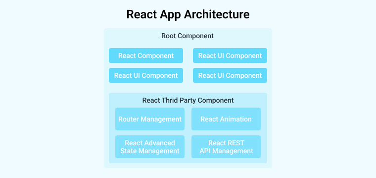
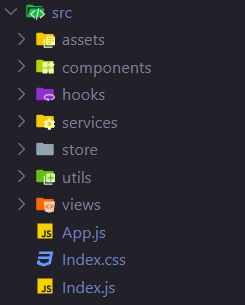
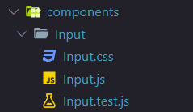
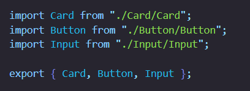
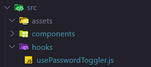
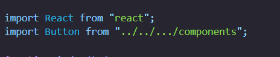

# What is react architecture?!
React architecture is a collection of components and software modules that helps us as a developer build an application’s user interface (UI).


- The modular design reduces the burden of upkeep and promotes code reusability.
- Using frameworks like Redux, global state management enables effective data management throughout every element.
- Allows for simple code growth and agility as projects expand.
- Due to its modular design, unit testing is a breeze.

# React Architecture Patterns:

1. Navigating a directory stucture
Organizing files and folders in Project software management helps developers quickly organize their files and easily find what they need.

A "src" folder in React holds all the project’s source code files and folders:


- Assets: holds static files like logos, fonts, and images and favicons.
- Components: contains UI codes, like buttons, forms, avatars, and so on.
- Hooks: contains reusable code and new component logic.
- Services: contains code for communicating with external APIs.
- Store: holds state management like Redux.
- Utils: simplifies reusable snippet functions.
- Views: web images.
- App.js: serves as the primary component of the application.
- Index.js: The React app entry point starts here.
- Index.css: the application’s global sheet style for styled-components.

<!--
- Context: stores all our React context files that are used across multiple pages.
- Lat: it contains lats available to the whole project like header, footer, etc.
- Pages: indicate the route of the react application. -->

2. Common modules
Common modules include reusable custom components, custom hooks, business logic, constants, and utility functions.

3. Add custom components in folders


- Input.js: the JavaScript file for writing all the logic for this component.
- Input.css: contains all the styles for this Input component.
- Input.test.js: contains all the test cases for this component.


With this file set up, we can then use it on any view or pages in our project.

4. Create custom hooks
It is a function that begins with "use" and may invoke other Hooks. Understanding this definition will help us use custom hooks effectively. Creating a custom hook is essential for reducing code complexity.


5. Use absolute imports


```js
// some file
import { Button } from "../../components";
```

When we have a React app with multiple nested folders using relative paths like “../../components,” importing can be highly confusing and hard to manage.

```js
{
 "compilerOptions": {
    "baseUrl": "src"
 },
 "include": ["src"]
}
```

we can now set absolute path for our component as follows:

```js
import { Button } from "components";
```

6. Open source session replay
Session Replay allows us to see exactly what happened in someone else’s browser at a later time. It is not a screen recording but a direct play of the real-time changes happening in the website’s elements. Out of all the session replay tools, OpenReplay is an open-source, fully functional version known for its user-friendly nature.

7. separate business logic from UI
While the business logic can be handled independently, the UI structure should be represented by React components kept in the ‘/pages’ or ‘/views’ directory.


```js
import axios from "axios";
const api = {
  fetchUsers: async () => {
    const URL = "https://jsonplaceholder.typicode.com/users";
    return await axios
      .get(URL)
      .then((res) => res)
      .catch((err) => err);
  },
};
export default api;
```

8. The utils directory
The Utils folder is where we can store the helper functions used throughout our application. It’s where we keep your code organized. we can place functions in this folder to provide common functionalities we may need in different parts of our app.

9. Avoiding creating a single context for everything
With React Context tool, we can transmit information up and down the component tree without resorting to prop drilling. It’s a different strategy that allows a parent component to prop up the complete child tree. In this method, passing unimportant props can be avoided while still facilitating data interchange.

```js
const App = () => {
  return (
    <UIProvider>
      <LangProvider>
        <Routes />
      </LangProvider>
    </UIProvider>
  );
};
```
***************************************************************************
# Two categories of components in react architecture:
| Component | architecture |
| --- | --- |
| Functional Component | React JS architecture Include JavaScript functions |
| Class component | Components made with classes pass data between themselves. These class components can be created using JavaScript ES6 classes. |
