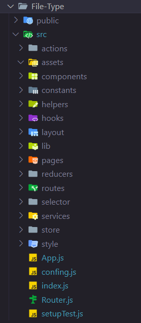

# React folder structure patterns
React doesn’t have opinions on how you put files into folders. That said there are a few common approaches popular in the ecosystem you may want to consider.

# popular approaches:
- Feature-Based Pattern
- Grouping by file type
- Atomic Design

# Feature-Based Pattern
It is like organizing your code in a React app by grouping similar things together.

- public: This is for static files like images, icons, etc.

- app: It’s a main application folder.

- features: We hold all features in that folder. Each feature has its own components, services, tests, .etc in this folder.

- shared: In the application, we will have a lot of common components, services, etc. We will keep these common files in the shared folder.

# Grouping by file type
We create folders for each type in the src folder. Every folder could have a common folder that contains shared utilities.

# Atomic Design
In Atomic Design, components are organized into five distinct levels based on their complexity and reusability.

- Atoms: Fundamental UI elements like buttons, inputs, icons. Highly reusable, minimal dependencies.

- Molecules: Composed of atoms, represent simple UI components with specific functionality. E.g., a search bar.

- Organisms: Complex UI components that combine multiple molecules and/or atoms. Represent specific UI sections or features.

- Templates: Provide the overall structure and layout, arrange organisms and molecules on the page.

- Pages: The final, fully-realized components users interact with, populate templates with content and data.
